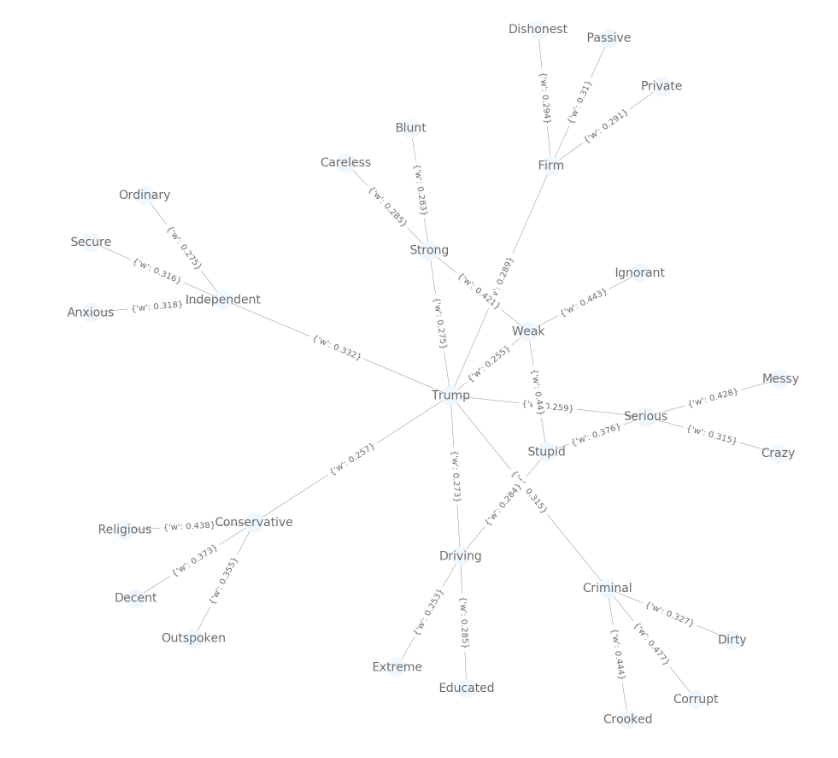

# ICRU_2019
Code for ICRU Research Fellowship for 2019. Contains scripts for cleaning the initial datasets (as the stopwords.txt file contains words to remove such as common articles), the word embedding generations, and the network creations for each dataset. 

The inflection script finds the second order derivative for numerical array, its purpose is tangentially related to the rest of the project. 

Both the nearest network and network related terms scripts perform tweet aggregation and cleaning and finally returning a network of similar words around a target word. These turn a collection of tweets into word vectors, and these vectors have a defined similarity to the vector corresponding to a particular candidate's name via the cosine similarity metric for vectors. The difference in the two is a different cleaning process. 

Adjective distance returns the nearest adjectives, as determined by a Word2Vec distance metric, for a particular word. Performing this task multiple times for the candidates name, and then for each of the adjectives closest to the candidates name, and so on, produces the network that displays the communication style of a particular population.  

Finally, the visualization script contains the network illustration that is present on the final poster. An example network can be seen in that file using data collected from the aforementioned scripts. 

To run this project, follow the instructions listed below (for simplicity I will assume it is cloned in the home directory): 
```
  git clone https://github.com/zainakh/ICRU_2019.git
  cd ICRU_2019
  pipenv install 
  pipenv shell
  jupyter lab
```

An example network that was produced using election tweets collected in 2016 is pictured here surrounding Donald Trump: 

